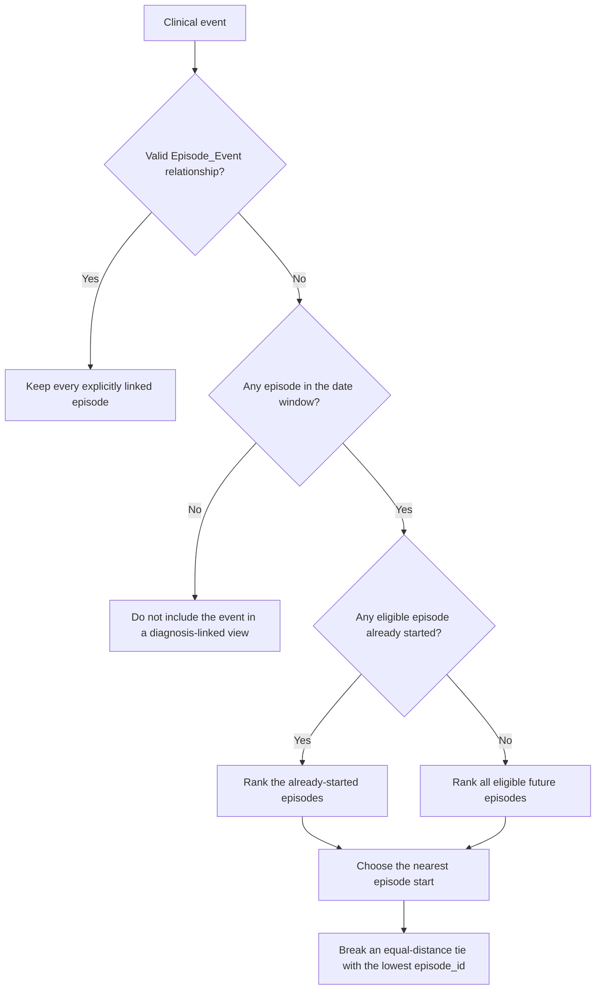

# Architecture

## Layering

The repository is organized into a small set of layers.

### Core

`omop_constructs.core` handles:

- construct registration
- dependency planning
- materialized view DDL
- registry inspection and validation

This is the operational layer that turns mapped SQLAlchemy classes into something you can manage as a dependency graph.

### Semantics

`omop_constructs.semantics` provides runtime concept resolver setup on top of `omop-semantics` value sets and `omop-alchemy` resolver helpers.

The default resolver set includes:

- `tnm_t_stage`
- `tnm_n_stage`
- `tnm_m_stage`
- `tnm_group_stage`
- `metastatic_disease`
- `tumor_grade`
- `rt_procedures`
- `country_of_birth`

### Alchemy Construct Families

The `omop_constructs.alchemy` package contains the construct definitions themselves:

- `modifiers`
- `episodes`
- `events`
- `demography`
- `conditions`

These are mostly SQLAlchemy `select()` fragments plus ORM-mapped materialized view classes.

## Registration Model

Construct classes are registered through `@register_construct`.

This has two consequences:

- registration happens at import time
- the registry is process-local and reflects what has been imported so far

That import-driven behavior is intentional and should be assumed by downstream consumers.

## Dependency Planning

`ConstructRegistry.plan()` builds a DAG from each construct class's `__deps__` tuple and topologically sorts it.

That ordering is reused for:

- `create_all`
- `refresh_all`
- `create_missing`
- `refresh_existing`

and reversed for `drop_all`.

Dependencies can point at constructs outside the currently imported set; those are treated as external and skipped during sorting rather than rejected.

## Event Attachment Strategy

Diagnosis-linked procedures, measurements, and observations use one attachment rule across the construct family. A valid `Episode_Event` relationship is authoritative when its event identifier, OMOP Field concept, episode identifier, and person agree. Every valid explicit relationship is retained, so an event deliberately linked to two episodes produces one row for each relationship.

When an event has no valid explicit relationship, the event date determines its episode. The eligible window begins 90 days before the episode start and ends on the episode end date. An episode without an end date remains eligible for 365 days after its start. From the eligible episodes, the resolver chooses one using these rules in order:

1. Prefer episodes that have started by the event date.
2. Choose the episode start nearest to the event date.
3. If two starts are equally near, choose the lowest `episode_id`.



For example, consider a patient whose first lung cancer episode starts on 10 January 2024 and remains active during ongoing care through 30 June 2026. A second primary lung cancer episode starts on 1 March 2026, and an unlinked spirometry measurement is recorded on 10 March 2026. Both episodes are eligible and have already started, so the resolver selects the second episode because its start is nearest to the measurement date. If the spirometry record has a valid explicit relationship to the first episode, that relationship is used instead. If it has valid explicit relationships to both episodes, both clinically asserted relationships are retained.

The resulting diagnosis-linked event views consistently expose the person identifier, event identifier, event date, event concept metadata, and attached disease episode metadata. Exact duplicates of the same source table, event, and episode relationship are removed.

## Visit Linkage

Visits are handled differently from observations and measurements.

`DxRelevantVisitMV` exposes provider-specialty visits linked to disease episodes. It uses a ranked proximity approach:

- visits within ±180 days of the episode start (`episode_prior == 1`) are always included
- for each visit, `rank=1` identifies its single highest-priority episode assignment, ordered by proximity tier then absolute day distance
- multiple visits per episode appear as separate rows
- each row carries one atomic specialty concept — no specialty grouping occurs here

This design means a downstream measurable can filter `DxRelevantVisitMV` by `provider_specialty_concept_id` and treat the result as an event stream, with grouping, de-duplication, and timing composition handled by the measure engine.

## Treatment Window And Consult Window Pattern

The episode layer exposes two important scalar-style constructs:

- `TreatmentEnvelopeMV`: earliest/latest treatment and treatment-derived scalar windows
- `ConsultWindowMV`: referral-derived specialist and treatment windows represented as episode-level scalars

`ConsultWindowMV` is built by combining:

- episode-of-care anchors
- diagnosis-linked consult observations from `DxObservationMV`
- episode-linked provider-specialty visits from `DxRelevantVisitMV`
- earliest treatment from `TreatmentEnvelopeMV`

### ConsultWindowMV vs DxRelevantVisitMV

| | `DxRelevantVisitMV` | `ConsultWindowMV` |
|---|---|---|
| Shape | one row per (visit, episode) | one scalar row per episode |
| Specialty | atomic concept per row | groups hardcoded specialty sets |
| Aggregation | none | `min(visit_start_date)` across specialty groups |
| Purpose | reusable event surface | oncology referral-timing scalars |
| Best suited to | reusable event streams and configurable timing measures | reports that require the existing episode-level oncology referral scalars |

Use `DxRelevantVisitMV` when a measure needs to select specialties or define its own time window. For example, a measure of days from GP referral to the first medical oncology, radiation oncology, or haematology visit can keep the referral observation as its anchor and supply all three specialty visit streams as candidates. Use `ConsultWindowMV` when a report directly consumes the existing `referral_to_specialist` or `referral_to_tx` episode scalar.

## Two-Measurable Temporal-Window Pattern

Referral-timing indicators use this pattern:

1. Define an observation measurable from `DxObservationMV`, such as a GP oncology referral filtered by `event_concept_id`, as the **anchor event**.
2. Define one or more visit measurables from `DxRelevantVisitMV`, such as one per specialist specialty concept, as **candidate events**.
3. Pass all candidate measurables to `measure_temporal_window` in `oa_cohorts`. The window engine selects from the candidates and computes the elapsed days from the anchor.

Example — "GP referral to first oncology specialist" indicator:

```
# Anchor: GP oncology referral observation
referral_obs = ObservationMeasurable(
    construct=DxObservationMV,
    person_id_attr="person_id",
    episode_id_attr="episode_id",
    event_date_attr="event_date",
    value_concept_attr="event_concept_id",
    concept_filter=[oncology_referral_concept_id],
)

# Candidates: specialist visits by specialty
medonc_visit = VisitMeasurable(
    construct=DxRelevantVisitMV,
    person_id_attr="person_id",
    episode_id_attr="episode_id",
    event_date_attr="visit_start_date",
    value_concept_attr="provider_specialty_concept_id",
    concept_filter=[medonc_concept_id],
)

radonc_visit = VisitMeasurable(
    construct=DxRelevantVisitMV,
    ...
    concept_filter=[radonc_concept_id],
)

haematology_visit = VisitMeasurable(
    construct=DxRelevantVisitMV,
    ...
    concept_filter=[haematologist_concept_id],
)

# Window engine (in oa_cohorts) combines candidates and measures against anchor
measure_temporal_window(
    anchor=referral_obs,
    candidates=[medonc_visit, radonc_visit, haematology_visit],
    threshold_days=X,
)
```
